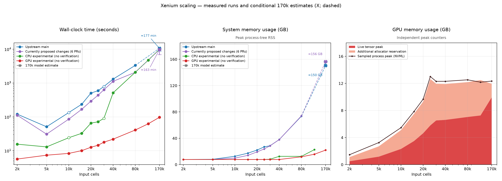

# Uncapped CPU-accounted scaling

Follow-up: [two serial repeat rounds at 2k–40k](benchmark-serial.md), queued after this sweep completes.

Last refreshed: 2026-10-10 12:53:32 UTC.

Currently proposed changes = pinned upstream main `ea1a15c` plus performance PRs [#4](upstream PR #4), [#5](upstream PR #5), [#6](upstream PR #6), [#7](upstream PR #7), [#8](upstream PR #8) and [#9](upstream PR #9). The six-PR filesystem snapshot includes the Arrow writer. Its serial follow-up sweep is underway after accuracy completed; current running and queued states appear in the CPU-accounted report. The original five-PR snapshot of PRs #4 and #6–#9 excluded #5; its evidence is retained in the historical archives. The open CLI fix #3 is outside both performance snapshots. CPU experimental (no verification) = `perf/exact-shortcuts` at `ff63f19`, with Arrow output, memory/storage refactors, Ward-engine and repeated-bin changes. This broader experimental integration is distinct from the open-PR snapshots. These benchmark records are pinned to their source snapshots; subsequent Git branch construction is documented in `fork-integration-audit.md`.

These follow-up runs have no elapsed-time limit. Each uses eight requested cores. The RAM scheduler reserves future growth and at least 11 GB of available memory; each supervisor stops a run if available RAM falls below 10 GB or SSD space below 2 GB. New runs are pinned to CPUs 0–7 or 8–15: eight distinct physical cores on the 5950X, with no SMT sibling shared between new pinned jobs. At most two jobs run at once, with only one new job while the surviving unpinned 170k run finishes. That original run is preserved without changing its affinity. Memory bandwidth, CPU boost and cache effects can still interact; timings are exploratory. The schedule records overlap, and four isolated 10k anchors run after unpinned work finishes. Fresh worker processes reuse filesystem/input/JIT caches; those caches are not flushed. CPU core-seconds count user and system CPU consumed by all threads and descendant workers in a dedicated Linux cgroup, measured at pipeline boundaries. They exclude loading and audit hashing. CPU time does not include GPU device work; use elapsed time for CPU/GPU latency comparisons. This sweep disables heatmap rendering consistently across every mode and size (plot=false); table formatting remains included, with large tables directed to /dev/null. The earlier sweep included heatmaps, so its times are not directly comparable to these calculation-focused measurements. Peak tree RSS sums processes and can count shared pages more than once; it excludes GPU VRAM.

The previous 170k CPU point was censored by an explicit 180-second process-time cap during baseline estimation, not by an observed memory failure. This sweep replaces that cap with completion or an explicitly reported resource/error outcome. Original evidence is retained.

| Input cells | Implementation | Status | Elapsed seconds | CPU core-seconds | Peak tree RSS, GB | CPU placement |
|---:|---|---|---:|---:|---:|---|
| 2,000 | Upstream main | ok | 120.61 | 144.88 | 7.70 | pinned physical8 |
| 5,000 | Upstream main | ok | 51.09 | 115.81 | 8.02 | pinned physical8 |
| 10,000 | Upstream main | ok | 134.19 | 226.67 | 12.61 | original unpinned |
| 15,000 | Upstream main | ok | 236.71 | 366.80 | 17.32 | pinned physical8 |
| 20,000 | Upstream main | ok | 505.85 | 693.49 | 22.04 | pinned physical8 |
| 25,000 | Upstream main | ok | 595.23 | 813.46 | 26.91 | pinned physical8 |
| 30,000 | Upstream main | ok | 795.16 | 1027.94 | 28.61 | original unpinned |
| 40,000 | Upstream main | ok | 1309.57 | 1617.39 | 38.00 | pinned physical8 |
| 80,000 | Upstream main | ok | 3337.18 | 3843.64 | 73.57 | pinned physical8 |
| 120,000 | Upstream main | memory_guard | — | — | 97.11 | pinned physical8 |
| 170,057 | Upstream main | memory_guard | — | — | 97.23 | pinned physical8 |
| 2,000 | Currently proposed changes (6 PRs) | ok | 111.92 | 115.40 | 7.73 | pinned physical8 |
| 5,000 | Currently proposed changes (6 PRs) | ok | 30.91 | 65.19 | 7.73 | pinned physical8 |
| 10,000 | Currently proposed changes (6 PRs) | ok | 85.83 | 146.25 | 9.84 | pinned physical8 |
| 15,000 | Currently proposed changes (6 PRs) | ok | 167.78 | 251.70 | 14.01 | pinned physical8 |
| 20,000 | Currently proposed changes (6 PRs) | ok | 292.30 | 403.01 | 19.29 | pinned physical8 |
| 25,000 | Currently proposed changes (6 PRs) | ok | 438.47 | 578.09 | 23.77 | pinned physical8 |
| 30,000 | Currently proposed changes (6 PRs) | ok | 633.05 | 801.72 | 28.52 | pinned physical8 |
| 40,000 | Currently proposed changes (6 PRs) | ok | 1127.23 | 1352.78 | 37.92 | pinned physical8 |
| 80,000 | Currently proposed changes (6 PRs) | ok | 2081.32 | 2466.09 | 74.06 | pinned physical8 |
| 120,000 | Currently proposed changes (6 PRs) | memory_guard | — | — | 94.80 | pinned physical8 |
| 170,057 | Currently proposed changes (6 PRs) | skipped_by_user | — | — | — | original unpinned |
| 2,000 | CPU experimental (no verification) | ok | 15.62 | 22.18 | 7.70 | pinned physical8 |
| 5,000 | CPU experimental (no verification) | ok | 12.98 | 36.43 | 7.70 | pinned physical8 |
| 10,000 | CPU experimental (no verification) | ok | 24.24 | 67.69 | 7.70 | original unpinned |
| 15,000 | CPU experimental (no verification) | ok | 32.76 | 103.88 | 7.70 | pinned physical8 |
| 20,000 | CPU experimental (no verification) | ok | 65.43 | 183.60 | 7.72 | pinned physical8 |
| 25,000 | CPU experimental (no verification) | ok | 71.69 | 179.67 | 7.73 | pinned physical8 |
| 30,000 | CPU experimental (no verification) | ok | 90.68 | 226.12 | 8.14 | original unpinned |
| 40,000 | CPU experimental (no verification) | ok | 515.38 | 684.40 | 12.53 | pinned physical8 |
| 80,000 | CPU experimental (no verification) | ok | 2088.29 | 2250.40 | 12.49 | pinned physical8 |
| 120,000 | CPU experimental (no verification) | ok | 4762.50 | 5439.67 | 22.74 | pinned physical8 |
| 170,057 | CPU experimental (no verification) | ok | 9908.56 | 10756.46 | — | original unpinned |
| 2,000 | GPU experimental (no verification) | ok | 5.68 | 5.64 | 7.73 | pinned physical8 |
| 5,000 | GPU experimental (no verification) | ok | 7.38 | 7.39 | 7.73 | pinned physical8 |
| 10,000 | GPU experimental (no verification) | ok | 8.35 | 8.35 | 7.73 | pinned physical8 |
| 15,000 | GPU experimental (no verification) | ok | 10.06 | 10.07 | 7.73 | pinned physical8 |
| 20,000 | GPU experimental (no verification) | ok | 12.68 | 12.69 | 7.73 | pinned physical8 |
| 25,000 | GPU experimental (no verification) | ok | 14.53 | 14.55 | 7.73 | pinned physical8 |
| 30,000 | GPU experimental (no verification) | ok | 17.94 | 17.96 | 7.73 | pinned physical8 |
| 40,000 | GPU experimental (no verification) | ok | 21.98 | 21.95 | 7.73 | pinned physical8 |
| 80,000 | GPU experimental (no verification) | ok | 41.02 | 41.08 | 11.81 | pinned physical8 |
| 120,000 | GPU experimental (no verification) | ok | 62.70 | 62.77 | 15.71 | pinned physical8 |
| 170,057 | GPU experimental (no verification) | ok | 97.35 | 97.50 | 21.98 | pinned physical8 |

X markers and dashed lines are extrapolated 170k points, not completed runs. Error bars show model sensitivity, not statistical confidence intervals. Other queued/running/resource-stopped runs have no completed point in this figure. The table states their status. Single cold runs establish cursory scaling, not a stable estimate of isolated PR effects. Filled markers are new physical-core pinned runs; hollow markers are original unpinned runs. Lines connect sample sizes and do not imply a single unchanged clustering engine across those sizes.

System RAM usage means the sampled sum of benchmark process-tree RSS, not total host RAM occupancy or unique physical pages. It excludes GPU VRAM. GPU memory is sampled separately per benchmark process with [NVML](https://docs.nvidia.com/deploy/nvml-api/latest/api/group__nvmlDeviceQueries.html), excluding desktop/other applications. Polling every 0.25s can miss brief peaks; The GPU stack compares independent peak counters: the live tensor peak and the reserved peak minus the live peak, summing to the allocator reserved peak. The sampled total process peak is overlaid as a separate line. These counters need not reach their peaks together. The NVML samples can miss a short-lived peak: at 120k the sampled total is below the allocator reserved high-water mark. The reserved-minus-allocated band reflects allocator headroom, including cached blocks, but cannot quantify the cache at the instant of peak process usage. The reruns are serial after accuracy, so another review calculation cannot force smaller GPU batches. Fresh GPU points replace the older GPU timings as they complete. Raw old results remain preserved.

## Why the earlier five-PR timings were similar

The snapshot was upstream plus the five recorded PR patches, not the wrong source. At 40k, the first serial main/subset runs took 1266.89/1261.79s. Shared gains reduced DLM smoothing from 9.27s to 1.95s, while the three clustering stages still totaled about 1038s and gene-table formatting took about 166s. The Arrow writer PR #5 was missing from this subset. Heatmap interpolation is outside these plot=false timings; known-normal membership and discarded fallback clustering help conditional paths, not every default run. The new six-PR sweep retains the real writer and directs its output to /dev/null, preserving formatting work while excluding SSD throughput.

## Conditional 170k projections

| Implementation | Elapsed estimate, min | Time model range, min | Host CPU estimate, core-min | Peak tree RSS estimate, GB | Memory model range, GB | Observed stop, min / GB |
|---|---:|---:|---:|---:|---:|---|
| Upstream main | 177.2 | 147.5–177.2 | 204.1 | 150.3 | 150.3–156.4 | 73.7 / 97.2 |
| Currently proposed changes (6 PRs) | 162.8 | 115.8–162.8 | 193.0 | 156.4 | 155.4–157.4 | not run; skipped by request |

These estimates assume sufficient RAM, the same algorithms and CPU placement, and no substantial swapping. They are not predictions of completion time under the current memory guard or heavy paging. Already completed stages in the stopped 170k run retain their observed time. The six-PR 170k run was skipped by user request: every stage is extrapolated from smaller inputs, with no measured 170k stage or memory lower bound. Missing clustering stages use completed 80k/120k stages with the same PCA128/fastcluster engine: a power-law fit when two observations exist, otherwise a quadratic assumption. Model ranges compare that estimate with quadratic and n·log(n) stage scaling. Other missing stages scale linearly from the largest completed stage. Completed stages from stopped 120k runs are usable stage evidence; their incomplete totals never enter the fit. Host CPU estimates apply the completed 80k CPU/elapsed ratio to the stage-based elapsed estimate; they are weaker extrapolations than the stage timings.

Memory uses a linear fit with intercept to successful pinned 20k–80k tree-RSS peaks. Its sensitivity range compares that fit with the last-two-point linear fit and proportional scaling from 80k. Stopped 120k/170k peaks are lower bounds and are not treated as completed peaks. Tree RSS can count shared pages more than once; these values are not exact physical-RAM requirements. The recovered CPU-stack 170k run has no comparable whole-run tree-RSS history, so its different cgroup-memory measurement is not plotted as tree RSS. All inputs, stage estimates and model parameters are saved in `/home/toresbe/cancer_research/benchmark_2026-10-09/results/170k_projections.json`.

## Output checks

| Cells | CPU experimental (no verification) vs upstream main | Currently proposed changes (6 PRs) vs upstream main |
|---:|---|---|
| 2,000 | cna_numeric: identical; prediction: identical; tree_structure: identical; tree_heights: different/missing | cna_numeric: identical; prediction: identical; tree_structure: identical; tree_heights: identical |
| 5,000 | cna_numeric: identical; prediction: identical; tree_structure: identical; tree_heights: different/missing | cna_numeric: identical; prediction: identical; tree_structure: identical; tree_heights: identical |
| 10,000 | cna_numeric: identical; prediction: identical; tree_structure: identical; tree_heights: different/missing | cna_numeric: identical; prediction: identical; tree_structure: identical; tree_heights: identical |
| 15,000 | cna_numeric: identical; prediction: identical; tree_structure: identical; tree_heights: different/missing | cna_numeric: identical; prediction: identical; tree_structure: identical; tree_heights: identical |
| 20,000 | cna_numeric: identical; prediction: identical; tree_structure: identical; tree_heights: different/missing | cna_numeric: identical; prediction: identical; tree_structure: identical; tree_heights: identical |
| 25,000 | cna_numeric: identical; prediction: identical; tree_structure: identical; tree_heights: different/missing | cna_numeric: identical; prediction: identical; tree_structure: identical; tree_heights: identical |
| 30,000 | cna_numeric: identical; prediction: identical; tree_structure: identical; tree_heights: different/missing | cna_numeric: identical; prediction: identical; tree_structure: identical; tree_heights: identical |
| 40,000 | cna_numeric: identical; prediction: identical; tree_structure: identical; tree_heights: different/missing | cna_numeric: identical; prediction: identical; tree_structure: identical; tree_heights: identical |
| 80,000 | cna_numeric: identical; prediction: identical; tree_structure: identical; tree_heights: different/missing | cna_numeric: identical; prediction: identical; tree_structure: identical; tree_heights: identical |
| 120,000 | awaiting completed pair | awaiting completed pair |
| 170,057 | awaiting completed pair | awaiting completed pair |

## Isolated 10k checks

Recovered CPU experimental (no verification) 170,057: original pipeline/cgroup CPU readings were retained. Original supervisor RSS-peak history was lost; whole-run cgroup memory peak is 29.86 GB. Cgroup memory includes charged cache and is a different metric from tree RSS.
These diagnostic checks run sequentially on CPUs 0–7 with no other review benchmark running. Comparing against the earlier 10k observations mixes changes in affinity, cache state and contention; it cannot attribute a difference to contention alone.

| Implementation | Status | Elapsed seconds | CPU core-seconds | Original 10k CPU / isolated CPU |
|---|---|---:|---:|---:|
| Upstream main | ok | 116.19 | 194.55 | 1.17 |
| Currently proposed changes (6 PRs) | queued | — | — | — |
| CPU experimental (no verification) | ok | 20.95 | 60.50 | 1.12 |
| GPU experimental (no verification) | ok | 8.24 | 8.23 | 1.01 |

## Clustering paths actually used

| Input cells | Implementation | Baseline estimation | Baseline adjustment | Final prediction |
|---:|---|---|---|---|
| 2,000 | Upstream main | full_matrix+fastcluster.linkage_vector | full_matrix+fastcluster.linkage_vector | full_matrix+fastcluster.linkage_vector |
| 5,000 | Upstream main | pca256+fastcluster.linkage_vector | pca256+fastcluster.linkage_vector | pca256+fastcluster.linkage_vector |
| 10,000 | Upstream main | pca256+fastcluster.linkage_vector | pca256+fastcluster.linkage_vector | pca256+fastcluster.linkage_vector |
| 15,000 | Upstream main | pca256+fastcluster.linkage_vector | pca256+fastcluster.linkage_vector | pca256+fastcluster.linkage_vector |
| 20,000 | Upstream main | pca256+fastcluster.linkage_vector | pca256+fastcluster.linkage_vector | pca256+fastcluster.linkage_vector |
| 25,000 | Upstream main | pca256+fastcluster.linkage_vector | pca256+fastcluster.linkage_vector | pca256+fastcluster.linkage_vector |
| 30,000 | Upstream main | pca256+fastcluster.linkage_vector | pca256+fastcluster.linkage_vector | pca256+fastcluster.linkage_vector |
| 40,000 | Upstream main | pca256+fastcluster.linkage_vector | pca256+fastcluster.linkage_vector | pca256+fastcluster.linkage_vector |
| 80,000 | Upstream main | pca128+fastcluster.linkage_vector | pca128+fastcluster.linkage_vector | pca128+fastcluster.linkage_vector |
| 120,000 | Upstream main | pca128+fastcluster.linkage_vector | pca128+fastcluster.linkage_vector | pca128+fastcluster.linkage_vector |
| 170,057 | Upstream main | pca128+fastcluster.linkage_vector | — | — |
| 2,000 | Currently proposed changes (6 PRs) | full_matrix+fastcluster.linkage_vector | full_matrix+fastcluster.linkage_vector | full_matrix+fastcluster.linkage_vector |
| 5,000 | Currently proposed changes (6 PRs) | pca256+fastcluster.linkage_vector | pca256+fastcluster.linkage_vector | pca256+fastcluster.linkage_vector |
| 10,000 | Currently proposed changes (6 PRs) | pca256+fastcluster.linkage_vector | pca256+fastcluster.linkage_vector | pca256+fastcluster.linkage_vector |
| 15,000 | Currently proposed changes (6 PRs) | pca256+fastcluster.linkage_vector | pca256+fastcluster.linkage_vector | pca256+fastcluster.linkage_vector |
| 20,000 | Currently proposed changes (6 PRs) | pca256+fastcluster.linkage_vector | pca256+fastcluster.linkage_vector | pca256+fastcluster.linkage_vector |
| 25,000 | Currently proposed changes (6 PRs) | pca256+fastcluster.linkage_vector | pca256+fastcluster.linkage_vector | pca256+fastcluster.linkage_vector |
| 30,000 | Currently proposed changes (6 PRs) | pca256+fastcluster.linkage_vector | pca256+fastcluster.linkage_vector | pca256+fastcluster.linkage_vector |
| 40,000 | Currently proposed changes (6 PRs) | pca256+fastcluster.linkage_vector | pca256+fastcluster.linkage_vector | pca256+fastcluster.linkage_vector |
| 80,000 | Currently proposed changes (6 PRs) | pca128+fastcluster.linkage_vector | pca128+fastcluster.linkage_vector | pca128+fastcluster.linkage_vector |
| 120,000 | Currently proposed changes (6 PRs) | pca128+fastcluster.linkage_vector | pca128+fastcluster.linkage_vector | pca128+fastcluster.linkage_vector |
| 170,057 | Currently proposed changes (6 PRs) | — | — | — |
| 2,000 | CPU experimental (no verification) | full_matrix+pdist+fastcluster.linkage | full_matrix+dedup195+pdist+fastcluster.linkage | full_matrix+dedup195+pdist+fastcluster.linkage |
| 5,000 | CPU experimental (no verification) | pca256+pdist+fastcluster.linkage | dedup135+pdist+fastcluster.linkage | dedup135+pdist+fastcluster.linkage |
| 10,000 | CPU experimental (no verification) | pca256+pdist+fastcluster.linkage | dedup154+pdist+fastcluster.linkage | dedup154+pdist+fastcluster.linkage |
| 15,000 | CPU experimental (no verification) | pca256+pdist+fastcluster.linkage | dedup165+pdist+fastcluster.linkage | dedup165+pdist+fastcluster.linkage |
| 20,000 | CPU experimental (no verification) | pca256+pdist+fastcluster.linkage | dedup153+pdist+fastcluster.linkage | dedup153+pdist+fastcluster.linkage |
| 25,000 | CPU experimental (no verification) | pca256+pdist+fastcluster.linkage | dedup155+pdist+fastcluster.linkage | dedup155+pdist+fastcluster.linkage |
| 30,000 | CPU experimental (no verification) | pca256+pdist+fastcluster.linkage | dedup142+pdist+fastcluster.linkage | dedup142+pdist+fastcluster.linkage |
| 40,000 | CPU experimental (no verification) | pca256+fastcluster.linkage_vector | dedup138+pdist+fastcluster.linkage | dedup138+pdist+fastcluster.linkage |
| 80,000 | CPU experimental (no verification) | pca128+fastcluster.linkage_vector | dedup128+fastcluster.linkage_vector | dedup128+fastcluster.linkage_vector |
| 120,000 | CPU experimental (no verification) | pca128+fastcluster.linkage_vector | pca128+fastcluster.linkage_vector | pca128+fastcluster.linkage_vector |
| 170,057 | CPU experimental (no verification) | pca128+fastcluster.linkage_vector | pca128+fastcluster.linkage_vector | pca128+fastcluster.linkage_vector |
| 2,000 | GPU experimental (no verification) | gpu.ward_rnn | dedup195+gpu.ward_rnn | dedup195+gpu.ward_rnn |
| 5,000 | GPU experimental (no verification) | gpu.ward_rnn | dedup140+gpu.ward_rnn | dedup140+gpu.ward_rnn |
| 10,000 | GPU experimental (no verification) | gpu.ward_rnn | dedup143+gpu.ward_rnn | dedup143+gpu.ward_rnn |
| 15,000 | GPU experimental (no verification) | gpu.ward_rnn | dedup145+gpu.ward_rnn | dedup145+gpu.ward_rnn |
| 20,000 | GPU experimental (no verification) | gpu.ward_rnn | dedup143+gpu.ward_rnn | dedup143+gpu.ward_rnn |
| 25,000 | GPU experimental (no verification) | gpu.ward_rnn | dedup149+gpu.ward_rnn | dedup149+gpu.ward_rnn |
| 30,000 | GPU experimental (no verification) | gpu.ward_rnn | dedup141+gpu.ward_rnn | dedup141+gpu.ward_rnn |
| 40,000 | GPU experimental (no verification) | gpu.ward_rnn+search512 | dedup152+gpu.ward_rnn | dedup152+gpu.ward_rnn |
| 80,000 | GPU experimental (no verification) | gpu.ward_rnn+search512 | dedup138+gpu.ward_rnn | dedup138+gpu.ward_rnn |
| 120,000 | GPU experimental (no verification) | gpu.ward_rnn+search512 | dedup149+gpu.ward_rnn | dedup149+gpu.ward_rnn |
| 170,057 | GPU experimental (no verification) | gpu.ward_rnn+search512 | dedup159+gpu.ward_rnn | dedup159+gpu.ward_rnn |

Raw evidence: `/home/toresbe/cancer_research/benchmark_2026-10-09/results`. The scheduler JSON records every admission, concurrent cohort, RAM estimate and completion. Source/input manifests and the deterministic nested sampling seed are shared with [the initial review report](benchmark-scaling.md). Calculation I/O and joblib memory maps use the SSD; archival evidence uses the NAS.

Full GPU repeat vs the earlier completed 170k run: cna_numeric: identical; prediction: identical; tree_structure: identical; tree_heights: identical.

Completed-sweep NAS archive target: `/mnt/nas/cancer_research/benchmark_2026-10-09/benchmark-cpuaccount-evidence.tar.gz`. It is created after every queued run has a recorded result, with a SHA256 sidecar; the original archive is preserved.
