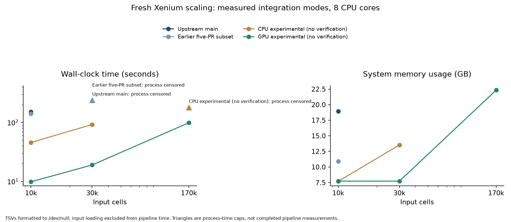
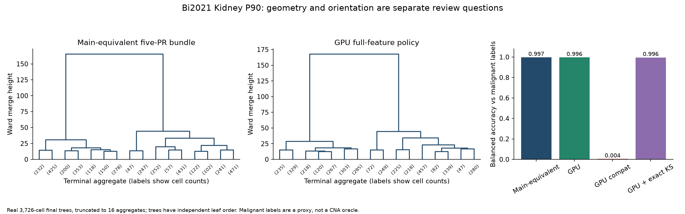
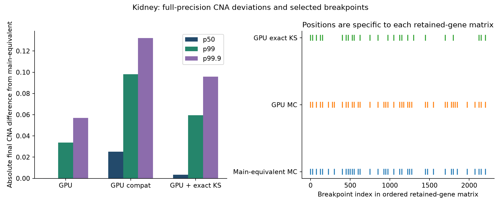
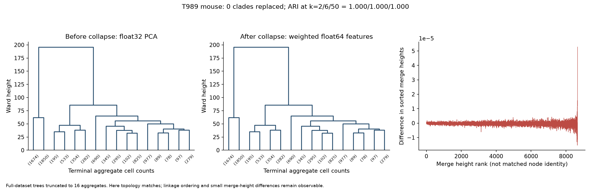

# Cursory benchmark evidence for the proposed changes

Follow-up: [uncapped CPU-accounted 10k / 30k / 170k runs](benchmark-cpu.md). The capped observations below are retained as original evidence.

Fresh measurements on 2026-10-09; one cold pipeline run per mode/size, 8 requested cores. These runs prioritize reviews, not statistically stable performance estimates. Source snapshots were exported from Git without changing branches. GPU access required execution outside the sandbox; the RTX 5080 driver works normally there. “Main” in the measurements means upstream at ea1a15c, not your proposed experimental fork main.

CPU/GPU modes use recorded Python environments and dependencies. Inputs and calculation scratch are on the SSD. Xenium subsets are nested deterministic subsets (seed 20261009). Pipeline time excludes input loading and audit hashing/compression, includes heatmaps and table formatting. Scaling tables go to `/dev/null`, so these timings exclude persistent output storage throughput. Kidney output files were actually written to SSD and hashed. Peak memory is sampled sum of RSS across the process tree, including input loading and audit work; it double-counts shared pages and is not PSS or GPU VRAM.

## 10k / 30k / full 170k scaling

| Input cells | Final cells (GPU) | Upstream main, s | Earlier five-PR subset, s | CPU experimental (no verification), s | GPU experimental (no verification), s |
|---:|---:|---|---|---|---|
| 10,000 | 7,763 | 152.3 | 140.9 | 45.7 | 9.8 |
| 30,000 | 23,357 | timeout at 240s process time | timeout at 240s process time | 92.3 | 19.0 |
| 170,057 | 132,027 | not attempted | not attempted | timeout at 180s process time | 98.8 |

Currently proposed changes = pinned upstream main `ea1a15c` plus performance PRs `#4`, `#5`, `#6`, `#7`, `#8` and `#9`. The six-PR filesystem snapshot includes the Arrow writer; its fresh follow-up sweep is underway after the accuracy phase, with current run status in the CPU-accounted report. Earlier five-PR subset = the original snapshot of PRs #4 and #6–#9; it excluded #5 and remains visible under this historical label. The open CLI fix #3 is outside both performance snapshots. CPU experimental (no verification) = `perf/exact-shortcuts` at `ff63f19`, with Arrow output, memory/storage refactors, Ward-engine and repeated-bin changes. This broader experimental integration is distinct from the open-PR snapshots. Source pins and patch order are recorded; no Git branch or ref was changed. GPU = `hardcore-optimization` at `14aae8d`, `backend=gpu`, default Monte Carlo KS. These integration timings do not isolate individual candidates or justify classifying the larger stacks as bit-identical.

At 170k, no fresh actual-main or five-candidate run was attempted: the saved pre-GPU 170k log already spends 47m10s in baseline estimation, 69m29s in baseline adjustment and 58m24s in final prediction, before finishing the heatmap. That older log is from d23282b, not actual main, and is not a completed runtime or a fresh result. The fresh larger-CPU-stack run is bounded to 180 seconds. Any timeout is a censored observation, not a completed timing. No 170k speedup ratio is inferred from that partial log.

## What the conservative bundle preserves

| Dataset | Main, s | Bundle, s | Speedup | Main / bundle peak tree RSS, GB | Numeric CNA / calls / merge structure / heights |
|---|---:|---:|---:|---|---|
| Bi2021 Kidney P90 | 82.4 | 76.9 | 1.07x | 11.1 / 6.2 | identical / identical / identical / identical |
| Xenium 10k | 152.3 | 140.9 | 1.08x | 18.9 / 10.9 | identical / identical / identical / identical |

On Kidney, both CNA TSV files, prediction text, clustering pickle and heatmap PNG are byte-identical. On Xenium 10k, heatmap/prediction/pickle bytes are identical; the large TSVs were sent to `/dev/null`, so their bytes were not checked. Original-dtype CNA hashes were checked; no float16 downcast was used. This sample pair does not exercise every known-normal/fallback branch. Broader historical validation is separately labeled.

## Changes that must remain visible to a reviewer

| Kidney mode | Pipeline, s | Balanced accuracy vs malignant labels | Final cells |
|---|---:|---:|---:|
| main | 82.4 | 0.9969 | 3,726 |
| five-candidate bundle | 76.9 | 0.9969 | 3,726 |
| gpu | 7.0 | 0.9961 | 3,726 |
| gpu-compat | 45.2 | 0.0044 | 3,726 |
| gpu + exact KS | 5.8 | 0.9958 | 3,726 |

`gpu-compat` reproduces a near-complete label inversion despite retaining the approximation policy. ARI can remain high under a label swap, so partition similarity alone is insufficient. The full-policy GPU and exact-KS variants also change numeric CNA and many tree clades; their fast runtime does not make those changes byte-preserving or establish biological correctness.

The trees above are final post-adjustment trees comparing whole modes, not a causal isolation of step-4 PCA. They are truncated to 16 aggregates, with independent leaf orders. Breakpoint positions refer to retained ordered-gene indices; exact lists are in the run JSON. These figures motivate the proposed separate calculation changes, rather than attributing every difference to one kernel.

| Whole GPU mode vs main-equivalent bundle | Median / p99.9 / max absolute final CNA deviation | Replaced final-tree clades | ARI k=2 / 6 / 50 |
|---|---|---:|---|
| kidney_gpu | 0.000254744 / 0.0570698 / 0.110158 | 2,909 | 0.995 / 0.598 / 0.185 |
| kidney_compat | 0.0252576 / 0.132114 / 0.205766 | 3,394 | 0.992 / 0.520 / 0.142 |
| kidney_exactks | 0.00347258 / 0.0957598 / 0.14215 | 3,475 | 0.994 / 0.565 / 0.125 |

These are original-precision, barcode-aligned differences over all 3,726 shared cells and 12,167 bins. They combine changes in reference selection, segmentation and arithmetic; they are not an estimate of isolated FP64 summation error.

## Real mouse linkage-byte counterexample

Fresh T989 replay: 49.3s before versus 34.9s after repeated-bin collapse/PCA bypass. 0 rooted clades replaced; max difference between sorted merge heights 5.27907e-05. ARI k=2/6/50: 1/1/1.

Final original-dtype CNA hashes: different.
Prediction hashes: identical.

The pre-collapse and collapse snapshots are adjacent revisions `350c1c0` and `5768793`. This comparison isolates that original bundled change, including its PCA bypass. Saved separate replay evidence identifies float32 PCA as the mechanism: casting its input to float64 restores the matching linkage rows/heights to float64 precision in that replay. C3 and C4 should therefore be separate reviews. Matching the final two-way calls does not imply matching the hierarchy.

## Which independent PRs look promising

| Candidate | Evidence | Priority interpretation |
|---|---|---|
| Shared DLM gains | Fresh conservative pipeline: Kidney smoothing 2.94s → 0.97s. Saved isolated warm sweeps also show substantial stage gains. | High for a small invariant-based review; pipeline impact is limited by other stages. |
| Thread pools | Saved independent function outputs are hash-identical across 1/8/32 cores; cluster-fit worker PSS drops sharply. Conservative bundle peak tree RSS also drops ~44% on Kidney. | High memory/value ratio; do not attribute the entire bundle reduction to this one change. |
| Heatmap interpolation | Identical fresh Kidney/Xenium PNGs. Kidney heatmap 46.3s → 42.9s in the conservative bundle; saved larger cases show rendering/memory gains. | Small review and useful memory reduction; ordering can dominate total plot time. |
| Skip unused GMM clustering | Saved outputs support equivalence; saved draft explicitly lacks isolated performance measurements. | Promising conditional shortcut; needs one isolated fallback benchmark before a speed claim. |
| Known-normal set | Exact membership shortcut; fresh default-mode samples do not exercise it. | Tiny review; benefit conditional on known-normal input. |
| Arrow gene writer | Saved independent SCPCL001108 run: writer 22.91s → 2.68s; pipeline 108.66s → 88.48s. Values preserved, text differs. | Strong immediate value, but outside strict byte-preserving wave. |
| Storage/Ward/collapse series | Fresh 10k larger CPU stack: 152.3s → 45.7s; full CNA and calls match, height bytes differ. | Largest CPU promise; isolate component effects and make numerical deviations explicit. |
| Repeated-row writer | Saved post-CPU-foundation 11-sample stage totals: output 63.6s → 7.3s. Fresh signed-zero edge test fails byte identity. | Strong CPU-reusable candidate after fixing run detection; fresh isolated performance benchmark still pending. |
| GPU full-policy backend | Fresh 10k/30k/170k: 9.8/19.0/98.8s. | Largest scaling benefit; bundled algorithm/label deviations require their own audit. |

Historical rows are evidence from previous local measurements, not fresh isolated PR benchmarks. The conservative integration has only five candidates; memory/Ward/output changes remain outside it.

Fresh repeated-row writer counterexample: the reference writes `g1	0	0`, while the repeated writer writes `g1	-0	0`. Numerically equal `+0.0` and `-0.0` are merged despite their distinct text representations. The helper must be fixed before a general byte-preservation claim; see `writer_edges.py`.

Fresh isolated DLM main on captured SCPCL001108 input [4068, 8121]: cold 1.5086s, median of three warm calls 0.5009s; original float32 output SHA256 `f4d8accf6b92e1169477282fb30491e211adc3c011fabd33e1fefa1cb3e7cd92`.

Fresh isolated DLM optimistic on captured SCPCL001108 input [4068, 8121]: cold 0.9448s, median of three warm calls 0.0972s; original float32 output SHA256 `f4d8accf6b92e1169477282fb30491e211adc3c011fabd33e1fefa1cb3e7cd92`.

## Reproduction and provenance

Raw results, progress, logs, linkage matrices, original-precision compressed CNA comparisons and source manifests: `$COPYKAT_BENCH_ROOT`. The NAS archive contains those small evidence files, source snapshots and review scripts; calculation scratch is excluded.

Use `benchmarks/campaign/prepare.py` to reconstruct snapshots from the recorded Git objects. The benchmark driver accepts `COPYKAT_BENCH_ROOT`, `COPYKAT_BENCH_PYTHON`, `COPYKAT_BENCH_GPU_PYTHON` and `COPYKAT_BENCH_XENIUM`. Stage T989 and the captured DLM input on your SSD before the corresponding follow-up runs. The shell sweeps document exact calls for this machine. Results include censored runs and their last completed stages. Snapshot and input manifests pin the implementations, seed and Xenium input checksum.

Before upstream performance claims, repeat shortlisted timings in alternating order with matched dependencies and controlled thread counts. Before scientific approval, add the per-change intermediate oracles and held-out validation specified in the proposal. This cursory integration audit is not a substitute for those focused review packets.
