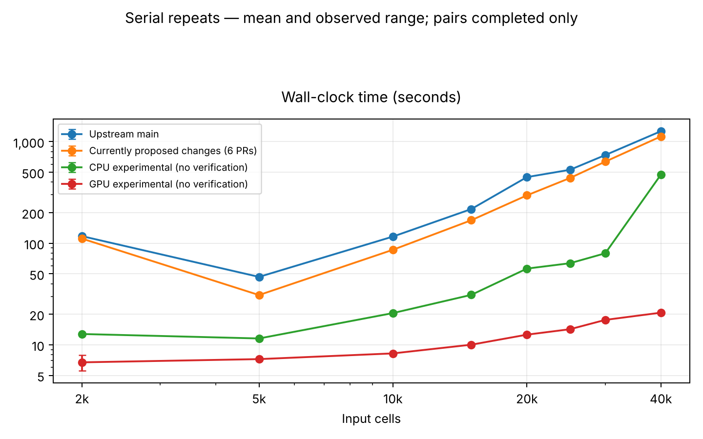

# Serial 2k–40k repeat benchmarks

Last refreshed: 2026-10-10 12:53:34 UTC.

Currently proposed changes = pinned upstream main `ea1a15c` plus performance PRs `#4`, `#5`, `#6`, `#7`, `#8` and `#9`. The six-PR filesystem snapshot includes the Arrow writer. Its serial follow-up sweep is underway after accuracy completed; current running and queued states appear in the CPU-accounted report. The original five-PR snapshot of PRs #4 and #6–#9 excluded #5; its evidence is retained in the historical archives. The open CLI fix #3 is outside both performance snapshots. CPU experimental (no verification) = `perf/exact-shortcuts` at `ff63f19`, with Arrow output, memory/storage refactors, Ward-engine and repeated-bin changes. This broader experimental integration is distinct from the open-PR snapshots. These benchmark records are pinned to their source snapshots; subsequent Git branch construction is documented in `fork-integration-audit.md`.

Status: serial phase started.

Two new runs per implementation and size, strictly one review calculation at a time, using CPUs 0–7 (eight physical cores), eight requested threads, the same nested inputs and seed, and unchanged source snapshots. Round two reverses both size and implementation order. Fresh processes reuse filesystem and compilation caches; caches are not flushed. No heatmaps; table formatting remains included with large TSVs directed to /dev/null. Input loading and audit hashing are excluded from pipeline timings. Other host activity can still affect results. CPU core-seconds exclude GPU device work.

Means use only successful runs from this serial phase. Parallel measurements and the earlier isolated anchors are not pooled. Sample standard deviation describes two observations, not a confidence interval or a precise estimate of variability. Failed attempts are shown and never averaged as completed runtimes.

| Input cells | Implementation | Successful / planned | Status | Elapsed mean ± SD, s | CPU mean ± SD, core-s | Elapsed range, s |
|---:|---|---:|---|---:|---:|---:|
| 2,000 | Upstream main | 2 / 2 | ok, ok | 117.54 ± 0.31 | 139.14 ± 0.67 | 117.32–117.76 |
| 5,000 | Upstream main | 2 / 2 | ok, ok | 46.67 ± 0.54 | 100.24 ± 1.15 | 46.29–47.05 |
| 10,000 | Upstream main | 2 / 2 | ok, ok | 116.42 ± 0.16 | 195.04 ± 1.18 | 116.30–116.53 |
| 15,000 | Upstream main | 2 / 2 | ok, ok | 217.16 ± 0.86 | 323.78 ± 1.87 | 216.55–217.77 |
| 20,000 | Upstream main | 2 / 2 | ok, ok | 448.07 ± 0.79 | 599.34 ± 1.35 | 447.51–448.63 |
| 25,000 | Upstream main | 2 / 2 | ok, ok | 528.95 ± 5.61 | 695.56 ± 6.76 | 524.99–532.92 |
| 30,000 | Upstream main | 2 / 2 | ok, ok | 738.17 ± 1.39 | 938.81 ± 1.30 | 737.18–739.16 |
| 40,000 | Upstream main | 2 / 2 | ok, ok | 1267.71 ± 1.17 | 1537.26 ± 2.53 | 1266.89–1268.54 |
| 2,000 | Currently proposed changes (6 PRs) | 2 / 2 | ok, ok | 111.14 ± 1.11 | 114.44 ± 1.35 | 110.35–111.92 |
| 5,000 | Currently proposed changes (6 PRs) | 2 / 2 | ok, ok | 30.92 ± 0.02 | 65.14 ± 0.08 | 30.91–30.94 |
| 10,000 | Currently proposed changes (6 PRs) | 2 / 2 | ok, ok | 86.32 ± 0.69 | 147.59 ± 1.89 | 85.83–86.80 |
| 15,000 | Currently proposed changes (6 PRs) | 2 / 2 | ok, ok | 168.61 ± 1.17 | 253.51 ± 2.55 | 167.78–169.44 |
| 20,000 | Currently proposed changes (6 PRs) | 2 / 2 | ok, ok | 296.24 ± 5.57 | 408.96 ± 8.41 | 292.30–300.18 |
| 25,000 | Currently proposed changes (6 PRs) | 2 / 2 | ok, ok | 439.16 ± 0.98 | 579.22 ± 1.60 | 438.47–439.85 |
| 30,000 | Currently proposed changes (6 PRs) | 2 / 2 | ok, ok | 636.11 ± 4.33 | 806.54 ± 6.80 | 633.05–639.17 |
| 40,000 | Currently proposed changes (6 PRs) | 2 / 2 | ok, ok | 1125.95 ± 1.81 | 1352.76 ± 0.03 | 1124.67–1127.23 |
| 2,000 | CPU experimental (no verification) | 2 / 2 | ok, ok | 12.79 ± 0.01 | 19.04 ± 0.08 | 12.79–12.80 |
| 5,000 | CPU experimental (no verification) | 2 / 2 | ok, ok | 11.56 ± 0.07 | 29.73 ± 0.20 | 11.50–11.61 |
| 10,000 | CPU experimental (no verification) | 2 / 2 | ok, ok | 20.55 ± 0.12 | 59.53 ± 0.12 | 20.46–20.63 |
| 15,000 | CPU experimental (no verification) | 2 / 2 | ok, ok | 31.06 ± 0.09 | 96.60 ± 0.25 | 30.99–31.12 |
| 20,000 | CPU experimental (no verification) | 2 / 2 | ok, ok | 56.32 ± 0.58 | 155.39 ± 1.96 | 55.91–56.73 |
| 25,000 | CPU experimental (no verification) | 2 / 2 | ok, ok | 63.64 ± 0.01 | 156.02 ± 0.53 | 63.63–63.65 |
| 30,000 | CPU experimental (no verification) | 2 / 2 | ok, ok | 79.69 ± 0.21 | 200.86 ± 0.07 | 79.55–79.84 |
| 40,000 | CPU experimental (no verification) | 2 / 2 | ok, ok | 473.30 ± 0.61 | 613.05 ± 1.72 | 472.87–473.73 |
| 2,000 | GPU experimental (no verification) | 2 / 2 | ok, ok | 6.73 ± 1.68 | 5.80 ± 0.37 | 5.54–7.91 |
| 5,000 | GPU experimental (no verification) | 2 / 2 | ok, ok | 7.24 ± 0.05 | 7.23 ± 0.04 | 7.20–7.27 |
| 10,000 | GPU experimental (no verification) | 2 / 2 | ok, ok | 8.24 ± 0.01 | 8.24 ± 0.00 | 8.23–8.25 |
| 15,000 | GPU experimental (no verification) | 2 / 2 | ok, ok | 10.04 ± 0.17 | 10.03 ± 0.15 | 9.92–10.16 |
| 20,000 | GPU experimental (no verification) | 2 / 2 | ok, ok | 12.60 ± 0.19 | 12.61 ± 0.20 | 12.47–12.74 |
| 25,000 | GPU experimental (no verification) | 2 / 2 | ok, ok | 14.26 ± 0.09 | 14.26 ± 0.07 | 14.20–14.33 |
| 30,000 | GPU experimental (no verification) | 2 / 2 | ok, ok | 17.61 ± 0.01 | 17.60 ± 0.02 | 17.60–17.62 |
| 40,000 | GPU experimental (no verification) | 2 / 2 | ok, ok | 20.74 ± 0.13 | 20.67 ± 0.01 | 20.66–20.83 |

Error bars show the observed minimum–maximum, not confidence intervals. Only pairs with two completed runs appear in this figure.

## Repeat output consistency

| Input cells | Implementation | CNA / predictions / merge structure / heights |
|---:|---|---|
| 2,000 | Upstream main | identical / identical / identical / identical |
| 5,000 | Upstream main | identical / identical / identical / identical |
| 10,000 | Upstream main | identical / identical / identical / identical |
| 15,000 | Upstream main | identical / identical / identical / identical |
| 20,000 | Upstream main | identical / identical / identical / identical |
| 25,000 | Upstream main | identical / identical / identical / identical |
| 30,000 | Upstream main | identical / identical / identical / identical |
| 40,000 | Upstream main | identical / identical / identical / identical |
| 2,000 | Currently proposed changes (6 PRs) | identical / identical / identical / identical |
| 5,000 | Currently proposed changes (6 PRs) | identical / identical / identical / identical |
| 10,000 | Currently proposed changes (6 PRs) | identical / identical / identical / identical |
| 15,000 | Currently proposed changes (6 PRs) | identical / identical / identical / identical |
| 20,000 | Currently proposed changes (6 PRs) | identical / identical / identical / identical |
| 25,000 | Currently proposed changes (6 PRs) | identical / identical / identical / identical |
| 30,000 | Currently proposed changes (6 PRs) | identical / identical / identical / identical |
| 40,000 | Currently proposed changes (6 PRs) | identical / identical / identical / identical |
| 2,000 | CPU experimental (no verification) | identical / identical / identical / identical |
| 5,000 | CPU experimental (no verification) | identical / identical / identical / identical |
| 10,000 | CPU experimental (no verification) | identical / identical / identical / identical |
| 15,000 | CPU experimental (no verification) | identical / identical / identical / identical |
| 20,000 | CPU experimental (no verification) | identical / identical / identical / identical |
| 25,000 | CPU experimental (no verification) | identical / identical / identical / identical |
| 30,000 | CPU experimental (no verification) | identical / identical / identical / identical |
| 40,000 | CPU experimental (no verification) | identical / identical / identical / identical |
| 2,000 | GPU experimental (no verification) | identical / identical / identical / identical |
| 5,000 | GPU experimental (no verification) | identical / identical / identical / identical |
| 10,000 | GPU experimental (no verification) | different/missing / identical / identical / identical |
| 15,000 | GPU experimental (no verification) | different/missing / identical / identical / identical |
| 20,000 | GPU experimental (no verification) | different/missing / identical / identical / identical |
| 25,000 | GPU experimental (no verification) | different/missing / identical / identical / identical |
| 30,000 | GPU experimental (no verification) | identical / identical / identical / identical |
| 40,000 | GPU experimental (no verification) | identical / identical / identical / identical |

Individual JSON results, source/input manifests and serial admission events are under `$COPYKAT_BENCH_ROOT`. Full-precision output hashes are retained. A separate NAS archive is created when the serial phase completes. [Original scaling and output checks](benchmark-cpu.md).
