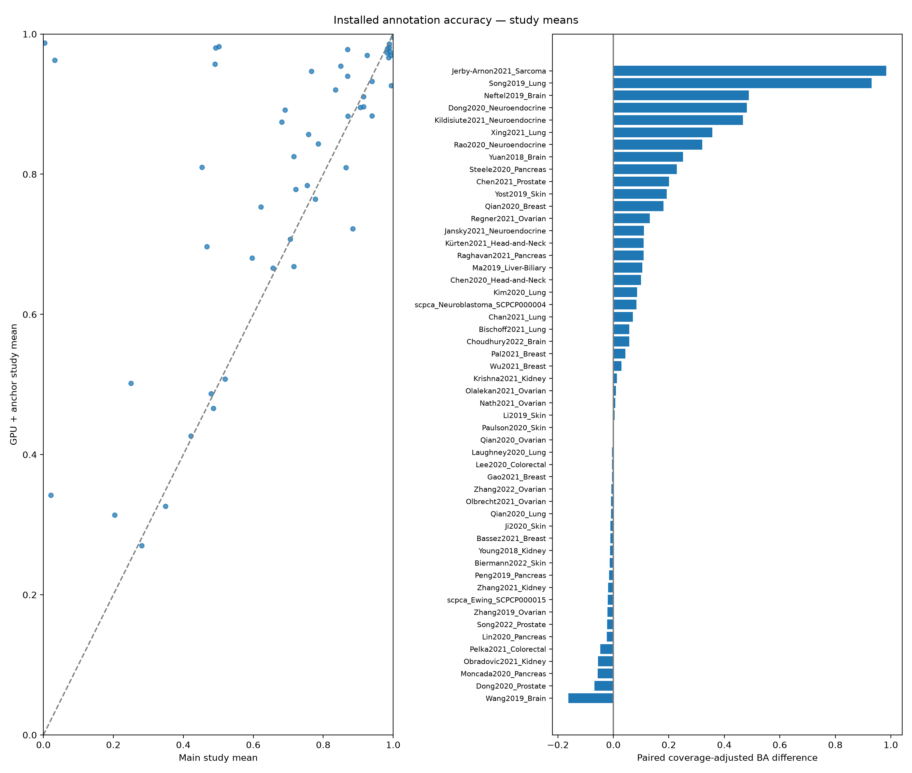
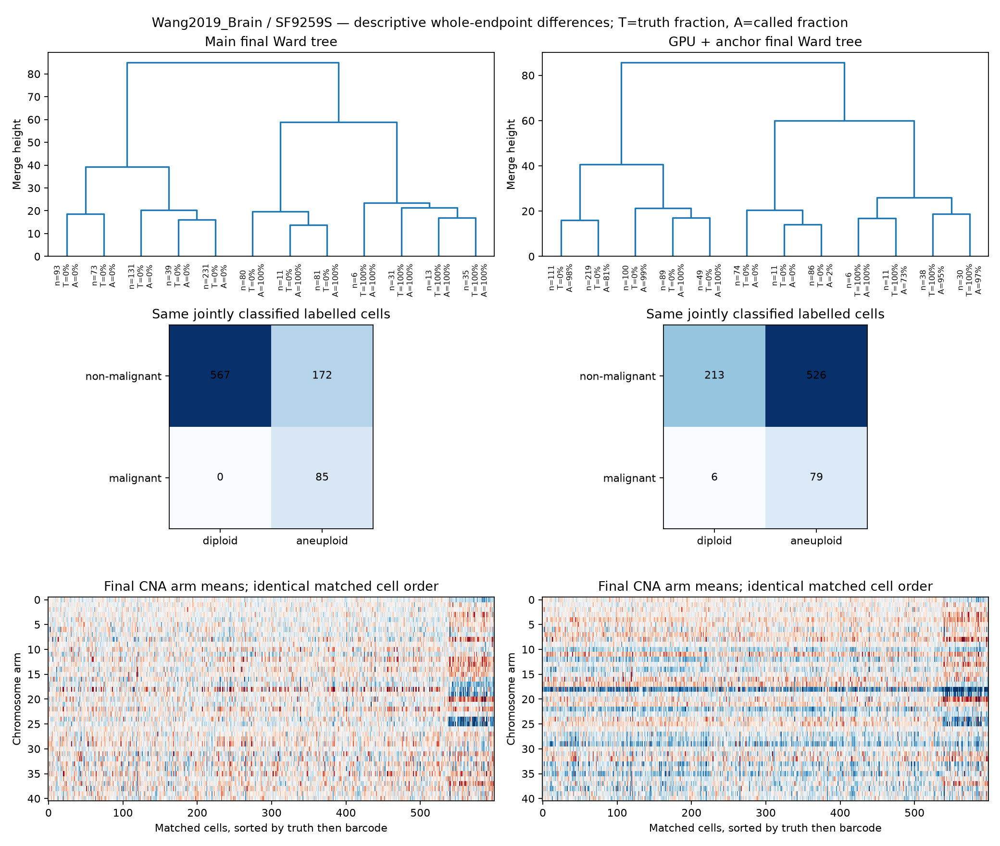
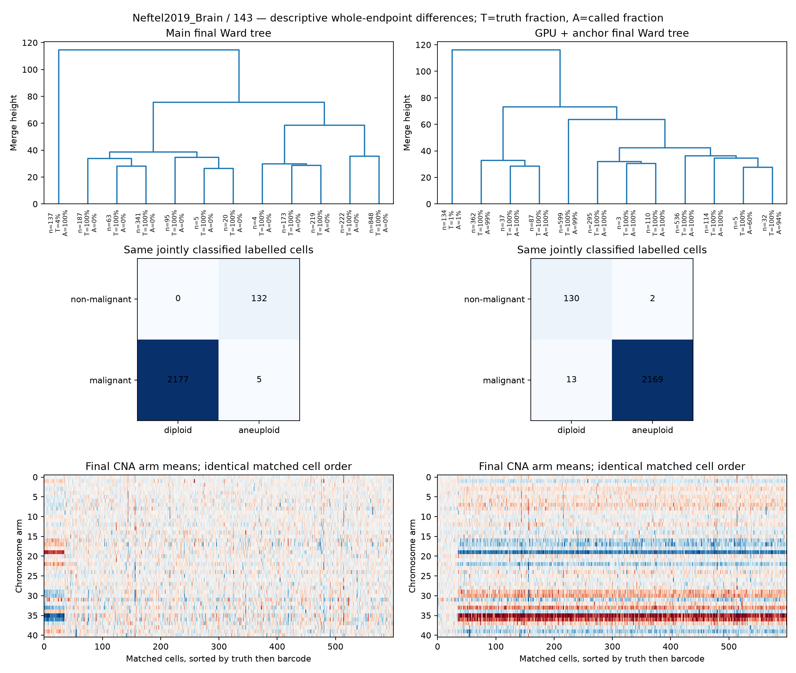

# Main versus GPU + marker anchoring: installed-data accuracy

Last refreshed: 2026-10-10 09:07:42 UTC.

This accuracy-only phase is queued after the serial performance repeats. No benchmark performance counters, timings or speed comparisons are collected. Reference: Navin Lab upstream main `ea1a15c`. Candidate: pinned `5401668`, GPU backend, B6 markers and F3 arm correlation, default Monte Carlo KS. Both use the same installed Python dependencies, four requested threads and identical raw inputs. Labels never enter the inference pipeline.

Author/OpenScPCA malignant labels are proxies for aneuploidy, not independent DNA ground truth. Many author annotations are partly CNA/marker-derived. These datasets were often used in prior development/evaluation; this is not a new sealed holdout. No method, anchor rule or threshold is tuned on these results.

Selected 125 samples from 60 studies; 121 completed aligned pairs. The frozen selection takes up to two fraction-extreme eligible samples per 3CA study, all eligible converted ScPCA libraries, eligible README samples, and up to two healthy donors per count-valid h5ad. Whole selected samples are used, without cell subsampling. Selection uses only installed data/labels and frozen size/class criteria, never model results.

## Paired study-level results

Coverage-adjusted balanced recall = half of correct malignant calls / all labelled malignant input cells plus correct non-malignant calls / all labelled non-malignant input cells. Unknown labels are unscored; filtered/unclassified cells cannot inflate this measure. Conditional balanced accuracy and coverage are shown separately. Normal-only controls have specificity/false positives rather than balanced accuracy.

| Stratum | Paired samples / studies | Main study mean | GPU+anchor study mean | Paired delta | Study-bootstrap 95% interval |
|---|---:|---:|---:|---:|---|
| all_input | 111 / 52 | 0.690 | 0.798 | +0.108 | [+0.053, +0.171] |
| non_anchor | 109 / 52 | 0.633 | 0.690 | +0.057 | [+0.020, +0.095] |
| non_marker | 111 / 52 | 0.658 | 0.745 | +0.088 | [+0.040, +0.143] |
| common_defined | 111 / 52 | 0.765 | 0.885 | +0.119 | [+0.061, +0.186] |

Non-anchor excludes the candidate’s actual reference cells from BOTH implementations. Non-marker excludes immune/endothelial marker-positive cells from BOTH. Common-defined scores use cells classified by BOTH, so they can still conceal QC attrition; read them with coverage-adjusted scores. Bootstrap resamples studies 10,000 times with seed 20261010; it does not remove annotation circularity or selection bias. Failures and missing pairs are not silently counted as successful results.

## Per-sample results

| Study / sample | Family; prior-use cohort | Main status | GPU status | Main / GPU conditional BA | Main / GPU coverage | Coverage-adjusted BA delta | Anchor path |
|---|---|---|---|---|---|---:|---|
| Bi2021_Kidney / Bi2021_Kidney_P90 | README; previous development | input_error | input_error | — / — | — / — | — | — |
| Chen2020_Head-and-Neck / Chen2020_Head-and-Neck_P11 | README; previous development | ok | ok | 0.799 / 0.896 | 0.942 / 0.942 | 0.099 | immune |
| Choudhury2022_Brain / Choudhury2022_Brain_MSC6-BTI | README; previous development | ok | ok | 0.847 / 0.917 | 0.843 / 0.843 | 0.057 | immune |
| Dong2020_Prostate / Dong2020_Prostate_patient5 | README; previous development | ok | ok | 0.996 / 0.928 | 0.998 / 0.998 | -0.068 | immune |
| Gao2021_Breast / Gao2021_Breast_DCIS1 | README; previous development | ok | ok | 1.000 / 0.995 | 1.000 / 1.000 | -0.005 | immune |
| Geistlinger2020_Ovarian / Geistlinger2020_Ovarian_T59 | README; previous development | input_error | input_error | — / — | — / — | — | — |
| Jerby-Arnon2021_Sarcoma / Jerby-Arnon2021_Sarcoma_SyS14 | README; previous development | ok | ok | 0.004 / 0.987 | 1.000 / 1.000 | 0.984 | enrichment |
| Ji2020_Skin / Ji2020_Skin_P4 | README; previous development | ok | ok | 0.906 / 0.895 | 1.000 / 1.000 | -0.011 | immune |
| Laughney2020_Lung / Laughney2020_Lung_RU681 | README; previous development | ok | ok | 0.936 / 0.932 | 0.989 / 0.989 | -0.004 | immune |
| Lee2020_Colorectal / Lee2020_Colorectal_SMC09 | README; previous development | ok | ok | 1.000 / 0.995 | 0.993 / 0.993 | -0.004 | immune |
| Lin2020_Pancreas / Lin2020_Pancreas_P08 | README; previous development | ok | ok | 0.994 / 0.970 | 0.999 / 0.999 | -0.024 | immune |
| Bassez2021_Breast / BIOKEY_5 | 3ca; previous holdout (already opened) | ok | ok | 0.475 / 0.451 | 0.566 / 0.566 | -0.014 | immune |
| Bassez2021_Breast / BIOKEY_26 | 3ca; previous holdout (already opened) | ok | ok | 0.482 / 0.468 | 0.653 / 0.653 | -0.007 | immune |
| Biermann2022_Skin / MBM08_sn | 3ca; previous development | ok | ok | 0.957 / 0.923 | 0.942 / 0.942 | -0.032 | immune |
| Biermann2022_Skin / MBM12_sn | 3ca; previous development | ok | ok | 0.698 / 0.705 | 0.966 / 0.966 | 0.007 | sigma |
| Bischoff2021_Lung / p030_T | 3ca; previous holdout (already opened) | ok | ok | 0.822 / 0.947 | 0.859 / 0.859 | 0.125 | immune |
| Bischoff2021_Lung / p032_T | 3ca; previous holdout (already opened) | ok | ok | 0.996 / 0.985 | 0.816 / 0.816 | -0.010 | immune |
| Chan2021_Lung / RU779D | 3ca; previous holdout (already opened) | ok | ok | 0.895 / 0.974 | 0.991 / 0.991 | 0.077 | immune |
| Chan2021_Lung / RU1293A | 3ca; previous holdout (already opened) | ok | ok | 0.903 / 0.972 | 0.942 / 0.942 | 0.064 | enrichment |
| Chen2021_Prostate / 5 | 3ca; previous development | ok | ok | 0.898 / 0.995 | 0.896 / 0.896 | 0.083 | immune |
| Chen2021_Prostate / 8 | 3ca; previous development | ok | ok | 0.587 / 0.905 | 1.000 / 1.000 | 0.318 | immune |
| Dong2020_Neuroendocrine / Tumor_19 | 3ca; previous development | ok | ok | 0.998 / 0.983 | 1.000 / 1.000 | -0.016 | immune |
| Dong2020_Neuroendocrine / Tumor_92 | 3ca; previous development | ok | ok | 0.004 / 0.982 | 0.999 / 0.999 | 0.977 | immune |
| Jansky2021_Neuroendocrine / NB02 | 3ca; previous development | ok | ok | 0.925 / 0.771 | 0.230 / 0.230 | -0.095 | sigma |
| Jansky2021_Neuroendocrine / NB09 | 3ca; previous development | ok | ok | 0.090 / 0.615 | 0.601 / 0.601 | 0.316 | immune |
| Kildisiute2021_Neuroendocrine / PD43255 | 3ca; previous holdout (already opened) | ok | ok | 0.999 / 0.992 | 0.981 / 0.981 | -0.007 | immune |
| Kildisiute2021_Neuroendocrine / PD46693 | 3ca; previous holdout (already opened) | ok | ok | 0.000 / 0.995 | 0.952 / 0.952 | 0.941 | immune |
| Kim2020_Lung / P1049 | 3ca; previous development | ok | ok | 0.812 / 0.994 | 0.932 / 0.932 | 0.180 | immune |
| Kim2020_Lung / P0034 | 3ca; previous development | ok | ok | 0.922 / 0.915 | 0.980 / 0.980 | -0.009 | immune |
| Krishna2021_Kidney / UT2_Far | 3ca; previous holdout (already opened) | ok | ok | 0.982 / 0.979 | 0.937 / 0.937 | -0.003 | immune |
| Krishna2021_Kidney / UT2_Center | 3ca; previous holdout (already opened) | ok | ok | 0.908 / 0.925 | 0.938 / 0.938 | 0.028 | immune |
| Kürten2021_Head-and-Neck / GSM5017041_HN08_CD45n | 3ca; previous development | ok | ok | 0.894 / 0.805 | 0.908 / 0.908 | -0.095 | endothelial |
| Kürten2021_Head-and-Neck / GSM5017056_HN13_CD45n | 3ca; previous development | ok | ok | 0.629 / 0.939 | 0.993 / 0.993 | 0.314 | endothelial |
| Li2019_Skin / p26 | 3ca; previous development | ok | ok | 0.959 / 0.773 | 0.304 / 0.304 | -0.204 | immune |
| Li2019_Skin / p25 | 3ca; previous development | ok | ok | 0.737 / 0.890 | 0.895 / 0.895 | 0.214 | enrichment |
| Ma2019_Liver-Biliary / H38 | 3ca; previous development | ok | ok | 0.999 / 0.983 | 0.993 / 0.993 | -0.016 | immune |
| Ma2019_Liver-Biliary / C46 | 3ca; previous development | ok | ok | 0.759 / 0.986 | 0.975 / 0.975 | 0.224 | immune |
| Moncada2020_Pancreas / PDAC_A | 3ca; previous holdout (already opened) | ok | ok | 0.989 / 0.966 | 0.952 / 0.952 | -0.022 | immune |
| Moncada2020_Pancreas / PDAC_B | 3ca; previous holdout (already opened) | ok | ok | 0.988 / 0.893 | 0.950 / 0.950 | -0.090 | endothelial |
| Nath2021_Ovarian / P17 | 3ca; previous holdout (already opened) | ok | ok | 0.338 / 0.348 | 0.998 / 0.998 | 0.010 | enrichment |
| Nath2021_Ovarian / P18 | 3ca; previous holdout (already opened) | ok | ok | 0.626 / 0.631 | 0.994 / 0.994 | 0.005 | sigma |
| Neftel2019_Brain / 115 | 3ca; previous holdout (already opened) | ok | ok | 0.984 / 0.972 | 0.999 / 0.999 | -0.012 | immune |
| Neftel2019_Brain / 143 | 3ca; previous holdout (already opened) | ok | ok | 0.001 / 0.989 | 1.000 / 1.000 | 0.988 | immune |
| Obradovic2021_Kidney / Patient1 | 3ca; previous development | ok | ok | 0.890 / 0.861 | 0.941 / 0.941 | -0.028 | endothelial |
| Obradovic2021_Kidney / Patient5 | 3ca; previous development | ok | ok | 0.969 / 0.879 | 0.912 / 0.912 | -0.083 | endothelial |
| Olalekan2021_Ovarian / omentum6885 | 3ca; previous development | ok | ok | 0.969 / 0.957 | 0.856 / 0.856 | -0.010 | immune |
| Olalekan2021_Ovarian / omentum2834 | 3ca; previous development | ok | ok | 0.559 / 0.594 | 0.836 / 0.836 | 0.030 | sigma |
| Olbrecht2021_Ovarian / P5_peritoneum_tumor | 3ca; previous holdout (already opened) | ok | ok | 0.999 / 0.982 | 1.000 / 1.000 | -0.017 | immune |
| Olbrecht2021_Ovarian / P7_peritoneum_tumor | 3ca; previous holdout (already opened) | ok | ok | 0.981 / 0.983 | 0.996 / 0.996 | 0.002 | immune |
| Pal2021_Breast / ER_positive_0043 | 3ca; previous development | ok | ok | 0.989 / 0.982 | 0.974 / 0.974 | -0.007 | sigma |
| Pal2021_Breast / Triple_negative_BRCA1_0554 | 3ca; previous development | ok | ok | 0.894 / 0.988 | 0.992 / 0.992 | 0.095 | immune |
| Paulson2020_Skin / 2586-4_Tumor_Before | 3ca; previous development | ok | ok | 0.968 / 0.973 | 0.908 / 0.908 | 0.002 | enrichment |
| Pelka2021_Colorectal / C124_T | 3ca; previous holdout (already opened) | ok | ok | 0.846 / 0.852 | 0.593 / 0.593 | 0.007 | immune |
| Pelka2021_Colorectal / C166_T | 3ca; previous holdout (already opened) | ok | ok | 0.977 / 0.874 | 0.961 / 0.961 | -0.102 | immune |
| Peng2019_Pancreas / T2 | 3ca; previous development | ok | ok | 1.000 / 0.975 | 0.963 / 0.963 | -0.024 | immune |
| Peng2019_Pancreas / T14 | 3ca; previous development | ok | ok | 1.000 / 0.994 | 1.000 / 1.000 | -0.006 | sigma |
| Qian2020_Breast / 42 | 3ca; previous holdout (already opened) | ok | ok | 0.732 / 0.967 | 0.985 / 0.985 | 0.221 | immune |
| Qian2020_Breast / 54 | 3ca; previous holdout (already opened) | ok | ok | 0.835 / 0.977 | 0.995 / 0.995 | 0.141 | enrichment |
| Qian2020_Lung / 2 | 3ca; previous development | ok | ok | 1.000 / 0.995 | 0.981 / 0.981 | -0.005 | immune |
| Qian2020_Lung / 5 | 3ca; previous development | ok | ok | 1.000 / 0.986 | 0.983 / 0.983 | -0.013 | immune |
| Qian2020_Ovarian / 11 | 3ca; previous holdout (already opened) | ok | ok | 0.999 / 0.995 | 0.988 / 0.988 | -0.005 | immune |
| Qian2020_Ovarian / 14 | 3ca; previous holdout (already opened) | ok | ok | 0.999 / 0.998 | 0.993 / 0.993 | -0.001 | enrichment |
| Raghavan2021_Pancreas / PANFR0489R_Biopsy_None | 3ca; previous holdout (already opened) | ok | ok | 0.983 / 0.986 | 0.989 / 0.989 | 0.003 | immune |
| Raghavan2021_Pancreas / PANFR0545_Biopsy_None | 3ca; previous holdout (already opened) | ok | ok | 0.763 / 0.978 | 0.998 / 0.998 | 0.214 | immune |
| Rao2020_Neuroendocrine / PriNET | 3ca; previous development | ok | ok | 0.044 / 0.915 | 0.732 / 0.732 | 0.638 | endothelial |
| Rao2020_Neuroendocrine / livMET | 3ca; previous development | ok | ok | 0.037 / 0.050 | 0.157 / 0.157 | 0.004 | sigma |
| Regner2021_Ovarian / 5 | 3ca; previous development | ok | ok | 0.321 / 0.599 | 0.988 / 0.988 | 0.276 | immune |
| Regner2021_Ovarian / 11 | 3ca; previous development | ok | ok | 0.943 / 0.929 | 0.992 / 0.992 | -0.013 | immune |
| Song2019_Lung / P4_Tumor | 3ca; previous holdout (already opened) | ok | ok | 0.032 / 0.965 | 0.998 / 0.998 | 0.931 | immune |
| Song2022_Prostate / PR5261_T | 3ca; previous development | ok | ok | 0.601 / 0.609 | 0.568 / 0.568 | 0.004 | endothelial |
| Song2022_Prostate / PR5249_T | 3ca; previous development | ok | ok | 0.557 / 0.507 | 0.786 / 0.786 | -0.050 | sigma |
| Steele2020_Pancreas / PDAC_TISSUE_10 | 3ca; previous holdout (already opened) | ok | ok | 0.174 / 0.531 | 0.929 / 0.929 | 0.319 | immune |
| Steele2020_Pancreas / PDAC_TISSUE_2 | 3ca; previous holdout (already opened) | ok | ok | 0.796 / 0.937 | 0.969 / 0.969 | 0.140 | immune |
| Wang2019_Brain / SF9259S | 3ca; previous development | ok | ok | 0.884 / 0.609 | 0.971 / 0.971 | -0.267 | enrichment |
| Wang2019_Brain / SF10022 | 3ca; previous development | ok | ok | 0.920 / 0.862 | 0.974 / 0.974 | -0.057 | immune |
| Wu2021_Breast / CID3963 | 3ca; previous holdout (already opened) | ok | ok | 0.909 / 0.982 | 0.870 / 0.870 | 0.065 | immune |
| Wu2021_Breast / CID4290A | 3ca; previous holdout (already opened) | ok | ok | 0.994 / 0.986 | 0.816 / 0.816 | -0.006 | sigma |
| Xing2021_Lung / NM6E | 3ca; previous holdout (already opened) | ok | ok | 0.117 / 0.895 | 0.848 / 0.848 | 0.717 | immune |
| Xing2021_Lung / SSN27 | 3ca; previous holdout (already opened) | ok | ok | 0.986 / 0.980 | 0.867 / 0.867 | -0.003 | immune |
| Yost2019_Skin / su006_post | 3ca; other installed study; prior use uncertain | ok | ok | 0.401 / 0.807 | 0.964 / 0.964 | 0.403 | immune |
| Yost2019_Skin / su003_post | 3ca; other installed study; prior use uncertain | ok | ok | 1.000 / 0.982 | 0.983 / 0.983 | -0.018 | immune |
| Young2018_Kidney / pRCC_Kid_T_ldc_1_2 | 3ca; previous development | ok | ok | 0.999 / 0.962 | 0.876 / 0.876 | -0.032 | immune |
| Young2018_Kidney / RCC2_Kid_T_ldc_1_1 | 3ca; previous development | ok | ok | 0.886 / 0.928 | 0.126 / 0.126 | 0.009 | immune |
| Yuan2018_Brain / PJ032 | 3ca; previous development | ok | ok | 0.031 / 0.941 | 0.373 / 0.373 | 0.348 | immune |
| Yuan2018_Brain / PJ018 | 3ca; previous development | ok | ok | 0.688 / 0.871 | 0.817 / 0.817 | 0.154 | enrichment |
| Zhang2019_Ovarian / VOA11543L | 3ca; previous holdout (already opened) | ok | ok | 0.986 / 0.951 | 1.000 / 1.000 | -0.036 | endothelial |
| Zhang2019_Ovarian / VOA11543R | 3ca; previous holdout (already opened) | ok | ok | 0.988 / 0.982 | 1.000 / 1.000 | -0.006 | enrichment |
| Zhang2021_Kidney / SI_18855 | 3ca; previous holdout (already opened) | ok | ok | 0.837 / 0.818 | 0.996 / 0.996 | -0.019 | immune |
| Zhang2021_Kidney / SI_21561 | 3ca; previous holdout (already opened) | ok | ok | 0.998 / 0.978 | 1.000 / 1.000 | -0.020 | immune |
| Zhang2022_Ovarian / EOC3_primary_Peritoneum | 3ca; previous holdout (already opened) | ok | ok | 1.000 / 0.990 | 0.832 / 0.832 | -0.008 | immune |
| Zhang2022_Ovarian / EOC733_primary_Peritoneum | 3ca; previous holdout (already opened) | ok | ok | 1.000 / 0.994 | 0.993 / 0.993 | -0.006 | immune |
| Zilionis2019_Lung / p4 | 3ca; previous development | input_error | input_error | — / — | — / — | — | — |
| Zilionis2019_Lung / p5 | 3ca; previous development | input_error | input_error | — / — | — / — | — | — |
| scpca_Ewing_SCPCP000015 / SCPCL000822 | scpca_3ca; ScPCA previously evaluated | ok | ok | 0.894 / 0.844 | 0.959 / 0.959 | -0.047 | endothelial |
| scpca_Ewing_SCPCP000015 / SCPCL001114 | scpca_3ca; ScPCA previously evaluated | ok | ok | 0.704 / 0.704 | 0.982 / 0.982 | 0.001 | sigma |
| scpca_Ewing_SCPCP000015 / SCPCL000824 | scpca_3ca; ScPCA previously evaluated | ok | ok | 0.739 / 0.663 | 0.930 / 0.930 | -0.067 | sigma |
| scpca_Ewing_SCPCP000015 / SCPCL001112 | scpca_3ca; ScPCA previously evaluated | ok | ok | 0.556 / 0.611 | 0.006 / 0.006 | 0.000 | sigma |
| scpca_Ewing_SCPCP000015 / SCPCL001113 | scpca_3ca; ScPCA previously evaluated | ok | ok | 0.502 / 0.532 | 0.736 / 0.736 | 0.010 | sigma |
| scpca_Neuroblastoma_SCPCP000004 / SCPCL000134 | scpca_3ca; ScPCA previously evaluated | ok | ok | 0.000 / 0.000 | 0.002 / 0.002 | 0.000 | sigma |
| scpca_Neuroblastoma_SCPCP000004 / SCPCL000141 | scpca_3ca; ScPCA previously evaluated | ok | ok | 0.975 / 0.903 | 0.697 / 0.697 | -0.064 | sigma |
| scpca_Neuroblastoma_SCPCP000004 / SCPCL000127 | scpca_3ca; ScPCA previously evaluated | ok | ok | 0.978 / 0.945 | 0.882 / 0.882 | -0.026 | immune |
| scpca_Neuroblastoma_SCPCP000004 / SCPCL000126 | scpca_3ca; ScPCA previously evaluated | ok | ok | 0.978 / 0.943 | 0.869 / 0.869 | -0.026 | immune |
| scpca_Neuroblastoma_SCPCP000004 / SCPCL000140 | scpca_3ca; ScPCA previously evaluated | ok | ok | 0.969 / 0.903 | 0.943 / 0.943 | -0.062 | sigma |
| scpca_Neuroblastoma_SCPCP000004 / SCPCL000137 | scpca_3ca; ScPCA previously evaluated | ok | ok | 0.702 / 0.928 | 0.538 / 0.538 | 0.156 | sigma |
| scpca_Neuroblastoma_SCPCP000004 / SCPCL000133 | scpca_3ca; ScPCA previously evaluated | ok | ok | 0.982 / 0.956 | 0.884 / 0.884 | -0.025 | enrichment |
| scpca_Neuroblastoma_SCPCP000004 / SCPCL000138 | scpca_3ca; ScPCA previously evaluated | ok | ok | 0.885 / 0.927 | 0.823 / 0.823 | 0.043 | enrichment |
| scpca_Neuroblastoma_SCPCP000004 / SCPCL000128 | scpca_3ca; ScPCA previously evaluated | ok | ok | 0.637 / 0.781 | 0.885 / 0.885 | 0.132 | enrichment |
| scpca_Neuroblastoma_SCPCP000004 / SCPCL000132 | scpca_3ca; ScPCA previously evaluated | ok | ok | 0.979 / 0.933 | 0.828 / 0.828 | -0.041 | sigma |
| scpca_Neuroblastoma_SCPCP000004 / SCPCL000136 | scpca_3ca; ScPCA previously evaluated | ok | ok | 0.770 / 0.965 | 0.893 / 0.893 | 0.183 | sigma |
| scpca_Neuroblastoma_SCPCP000004 / SCPCL000129 | scpca_3ca; ScPCA previously evaluated | ok | ok | 0.702 / 0.916 | 0.901 / 0.901 | 0.197 | sigma |
| scpca_Neuroblastoma_SCPCP000004 / SCPCL000123 | scpca_3ca; ScPCA previously evaluated | ok | ok | 0.011 / 0.988 | 0.966 / 0.966 | 0.897 | immune |
| scpca_Neuroblastoma_SCPCP000004 / SCPCL000135 | scpca_3ca; ScPCA previously evaluated | ok | ok | 0.707 / 0.954 | 0.842 / 0.842 | 0.225 | enrichment |
| scpca_Neuroblastoma_SCPCP000004 / SCPCL000130 | scpca_3ca; ScPCA previously evaluated | ok | ok | 0.819 / 0.608 | 0.795 / 0.795 | -0.170 | sigma |
| scpca_Neuroblastoma_SCPCP000004 / SCPCL000139 | scpca_3ca; ScPCA previously evaluated | ok | ok | 0.820 / 0.855 | 0.954 / 0.954 | 0.033 | sigma |
| scpca_Neuroblastoma_SCPCP000004 / SCPCL000142 | scpca_3ca; ScPCA previously evaluated | ok | ok | 0.972 / 0.944 | 0.984 / 0.984 | -0.027 | immune |
| TS_Bone_Marrow / TSP27 | healthy controls; normal-only control; prior use uncertain | ok | ok | — / — | 0.997 / 0.997 | — | immune |
| TS_Bone_Marrow / TSP14 | healthy controls; normal-only control; prior use uncertain | ok | ok | — / — | 0.973 / 0.973 | — | immune |
| TS_Skin / TSP2 | healthy controls; normal-only control; prior use uncertain | ok | ok | — / — | 0.887 / 0.887 | — | immune |
| TS_Skin / TSP21 | healthy controls; normal-only control; prior use uncertain | ok | ok | — / — | 0.989 / 0.989 | — | immune |
| TS_Stomach / TSP25 | healthy controls; normal-only control; prior use uncertain | ok | ok | — / — | 0.998 / 0.998 | — | immune |
| TS_Stomach / TSP27 | healthy controls; normal-only control; prior use uncertain | ok | ok | — / — | 0.964 / 0.964 | — | immune |
| TS_Tongue / TSP25 | healthy controls; normal-only control; prior use uncertain | ok | ok | — / — | 0.995 / 0.995 | — | immune |
| TS_Tongue / TSP27 | healthy controls; normal-only control; prior use uncertain | ok | ok | — / — | 0.995 / 0.995 | — | sigma |
| census_brain_dlPFC_glia / HSB628 | healthy controls; normal-only control; prior use uncertain | ok | ok | — / — | 0.990 / 0.990 | — | sigma |
| census_brain_dlPFC_glia / HSB106 | healthy controls; normal-only control; prior use uncertain | ok | ok | — / — | 0.968 / 0.968 | — | sigma |

## Healthy controls

| Implementation | Completed samples | Mean specificity including abstentions | Mean classified fraction |
|---|---:|---:|---:|
| main | 10 | 0.514 | 0.976 |
| gpu_anchor | 10 | 0.704 | 0.976 |

## Selection exclusions

| Reason | Records |
|---|---:|
| no sample/cell_type metadata | 2 |
| not explicitly UMI-count matrix | 30 |
| outside frozen cell/class criteria | 879 |
| two-per-study cap across split matrices | 12 |
| two-per-study cap; fraction-extreme selection | 336 |

Each exclusion, source path and selected sample is retained in `dataset_manifest.json`. Unlabelled Xenium, mouse data, unsupported/non-UMI formats and unmapped DNA/RNA profiles are outside this cell-call panel; no genomic-profile accuracy claim is made. The cell-type error tables, paired per-cell calls, reference membership, full-precision final CNA arm means and linkage matrices are under `/home/toresbe/cancer_research/navin_accuracy_2026-10-10/results`. Compact diagnostics use original-precision calculations; the candidate’s own F3 precision policy remains unchanged. Calculation I/O and caches use the SSD; the final evidence archive uses the NAS.

Trees have independent leaf orders and are truncated to 12 aggregates. Candidate F3 calls are not determined by these final Ward trees. Heatmaps share color limits and matched cell order; displayed cells are deterministically thinned to at most 600, while metrics and stored arm data use every cell. Extremes are selected only for descriptive diagnostics, not for changing any rule.
